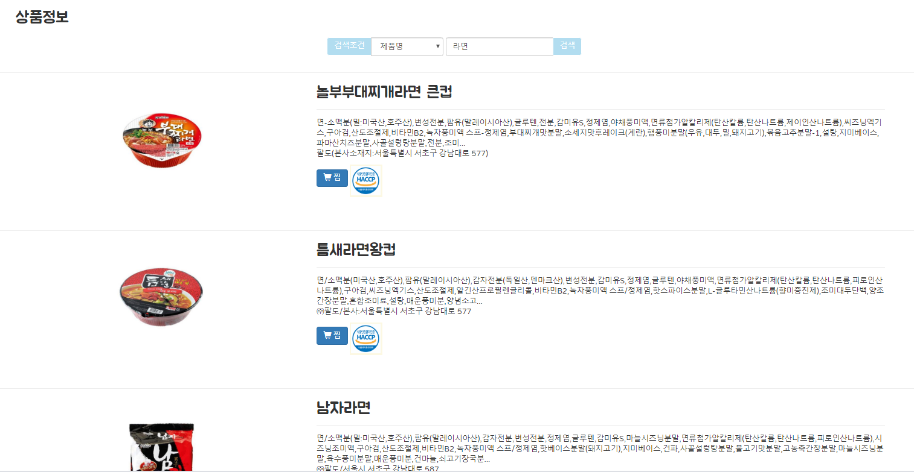
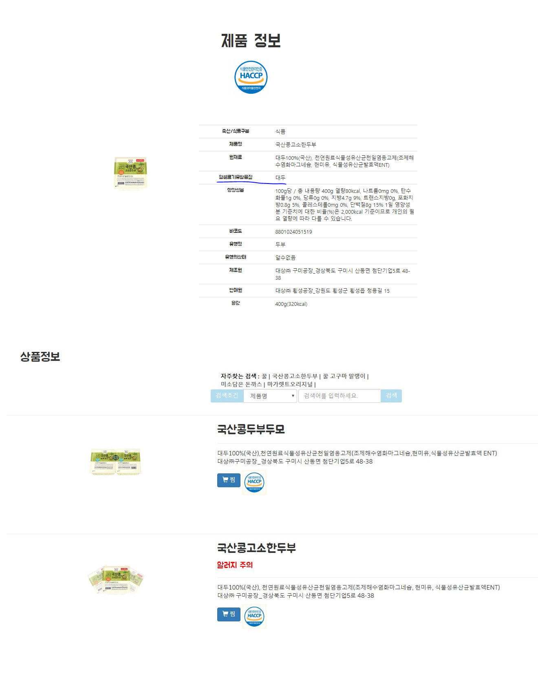
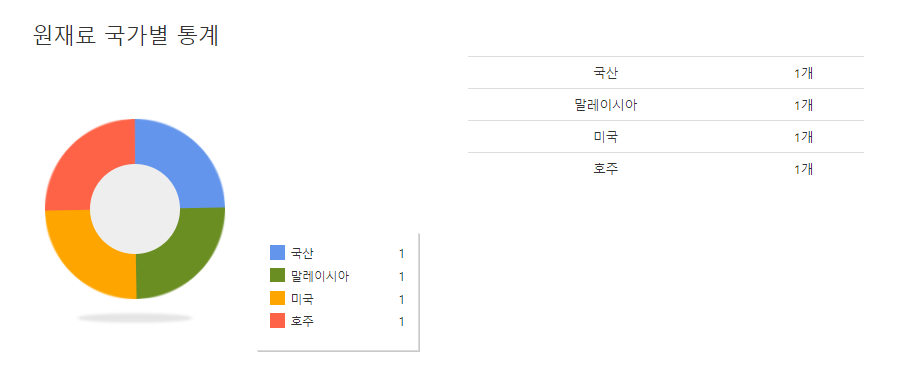
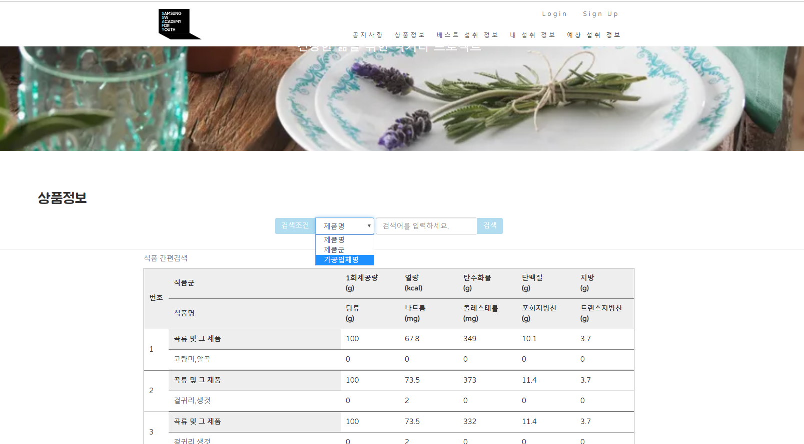
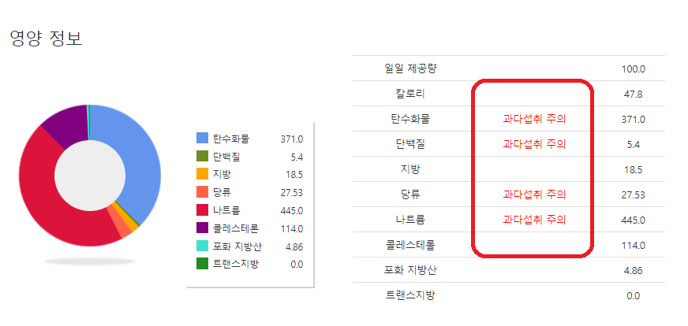
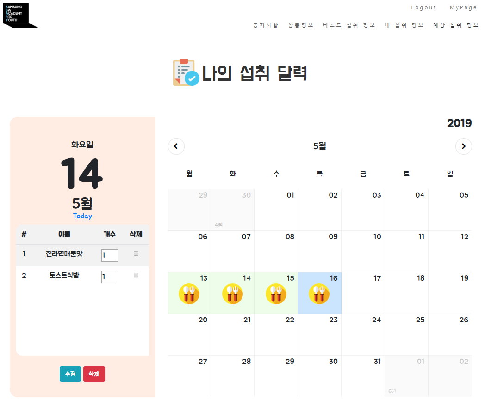
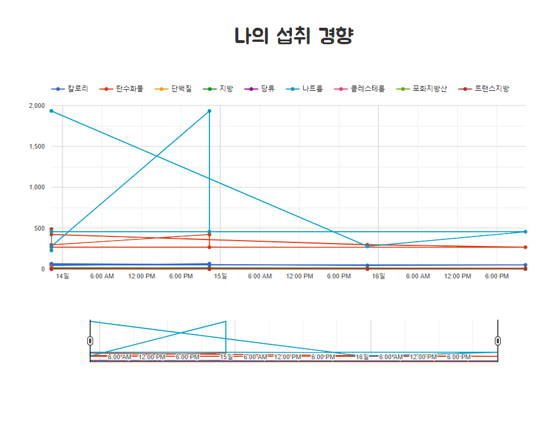
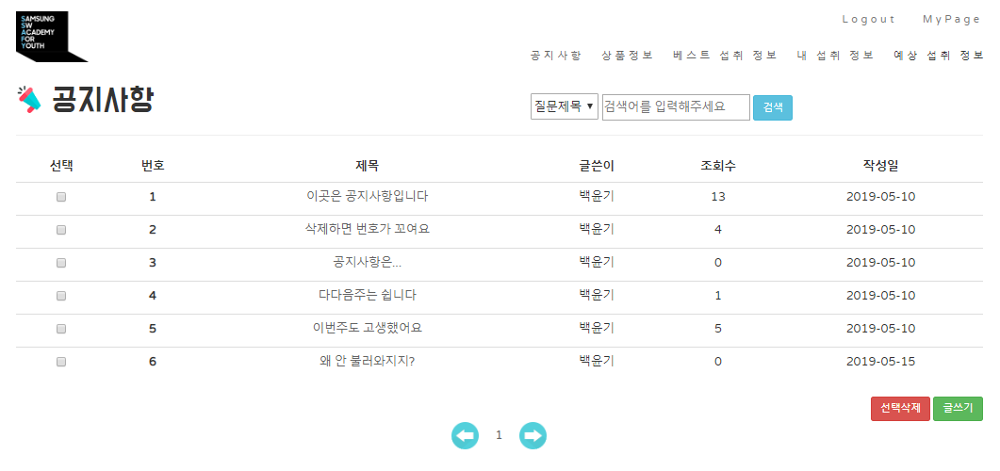
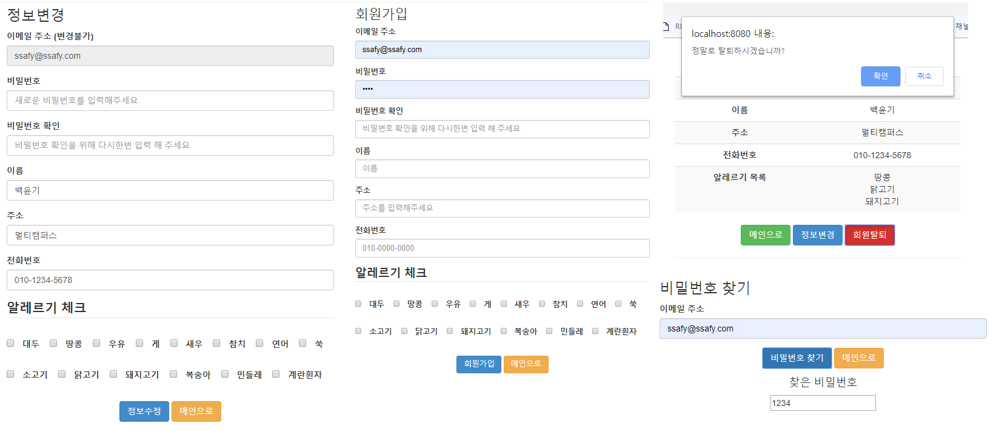

# 식품 안전 데이터 웹페이지
식품 영양정보 DB, HACCP 인증 식품 포장지 정보 등 공공데이터를 활용한 Spring 웹 프로젝트

## 사용 기술
> 언어 : Java, JavaScript, Mysql, Mybatis, Vue.js
>
> 툴 : Spring Suite Tool, Mysql Workbanch

## 주요기능
> 
> ### 1. HACCP 식품 데이터
> ***
> 
> ```
> 식품 안전 정보의 메인페이지. HACCP인증 식품들을 위주로 노출되며 식품명, 보고번호로 검색할 수 있다.
> ```
>
> 
> ```
> 회원의 알레르기 주의 식품은 주의 표시가 별도로 표기.
> 상세 페이지에는 상세 식품 정보표를 제공
> ```
>
> 
> ```
> 상세 페이지 하단에는 원재료 국가별 표시 및 통계표를 제공
> ```
>
> ### 2. 식품 영양정보 DB
> ***
> 
> ```
> 식품 영양정보 공공데이터를 활용하여 식품군, 식품명, 가공업체별 리스트를 제공
> ```
>
> 
> ```
> 식품 영양정보 공공데이터를 활용하여 식품군, 식품명, 가공업체별 리스트를 제공
> ```
>
> ### 3. 나의 섭취식품 페이지
> ***
> 
>
> * 섭취식품 달력 하단의 세가지 탭
>
> 
> 
> 
> ```
> 회원의 섭취 식품과 찜한 식품을 관리하고 통계를 보여주는 페이지
> Google Chart Api와 Vue를 활용
> ```
>
> ### 4. 공지사항과 로그인 기능
> ***
> ```
> * Spring Boot로 공지사항 Restful Api를 제공하고 그 데이터를 게시판 형식으로 보여주는 페이지.
> * 회원관리와 로그인 구현
> ```
>
> 
> ***
> 
> 
